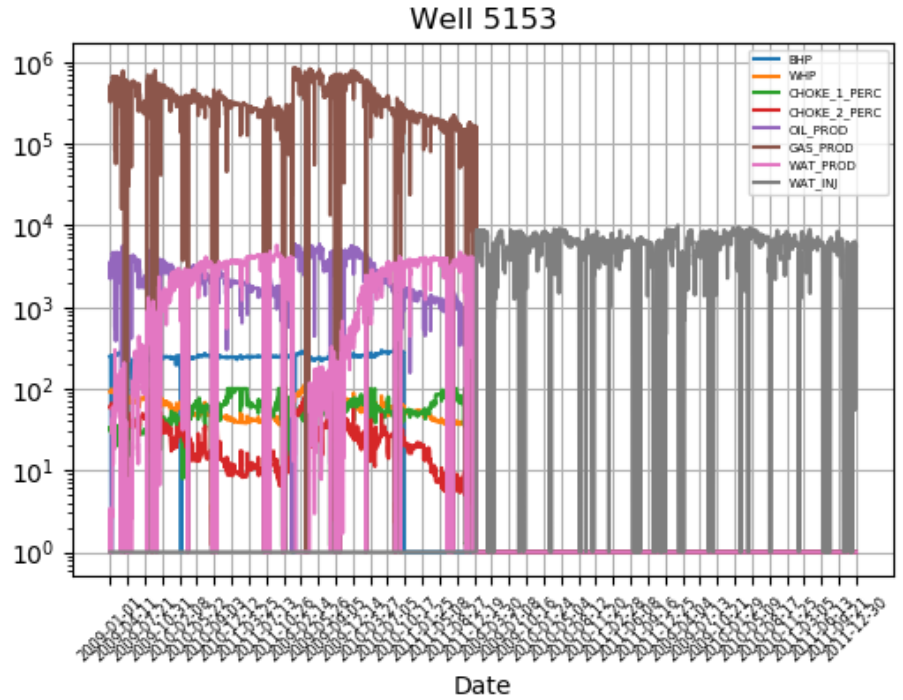

# Predicting oil and water productions via a GRU model
This project implements a simple GRU model to predict oil and water productions from two wells
using time series data.


 
## Environment
Please, consider Jupyter notebook to study the project.
```bash
jupyter notebook forecasting.ipynb
```